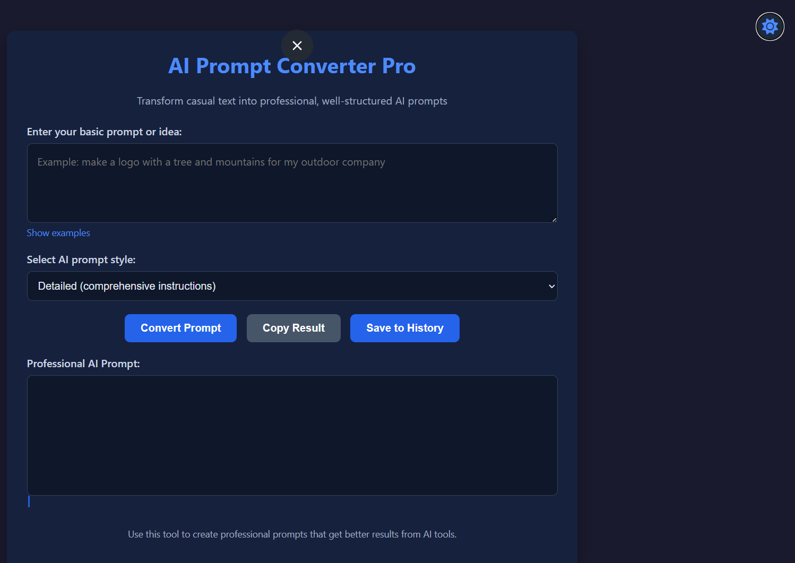

# AI Prompt Converter Pro

**AI Prompt Converter Pro** is a web-based tool that transforms casual user input into professional AI prompts. This tool supports multiple styles of prompts such as ChatGPT-optimized, Midjourney, detailed, professional business, creative writing, and custom templates. It is designed to help users generate high-quality prompts tailored to their needs, with features like theme toggling, input examples, copy/save buttons, and prompt history.

## Features

- **Multiple Prompt Styles**: Transform input into various AI-optimized prompts for different use cases.
- **Custom Templates**: Create your own custom prompt formats.
- **Prompt History**: Keep track of your generated prompts for easy access later.
- **Theme Toggling**: Switch between light and dark themes for a personalized experience.
- **Copy/Save**: Quickly copy or save your generated prompts.
- **Input Examples**: See examples of how to use the tool effectively.

## Usage

1. **Select the desired prompt style** (e.g., ChatGPT, Midjourney, etc.).
2. **Enter your casual input** in the provided input field.
3. **View the converted professional prompt** in the output area.
4. **Toggle between themes** using the theme toggle switch.
5. **Copy or save your prompt** for future use.
6. **Review prompt examples** by clicking the "Show Examples" button.

